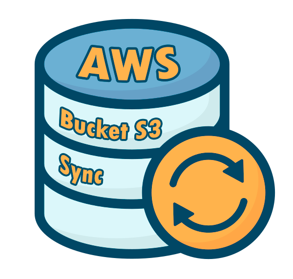

<h1 align="center"> Backup AWS Bucket S3 Sync</h1>

Scripts de **PowerShell** y **Bash Shell Script** para automatizar el proceso de sincronización de datos locales a un bucket S3 (Simple Storage Service) de Amazon Web Services a través de la interfaz de línea de comandos de AWSCLI (serverless).

  

